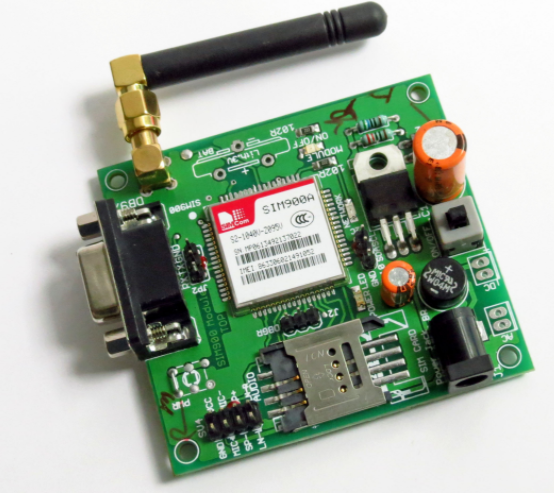
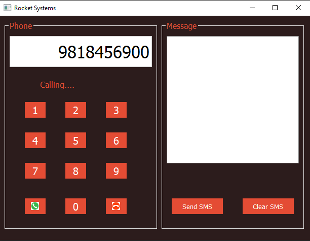

# GSMSIM900PyQt5

This project contains a PyQt5 based UI application to interface with GSM SIM900 module.

Below is how the GSM SIM900 module looks like, yours can be different but all the simcom modules are same and works on serial communication.

In this project, pyembedded python library has been used which is an easy to use library to interface with RFID, GSM, GPS.

https://pypi.org/project/pyembedded/

UI has been created which allows us to make call to any number and send sms.

